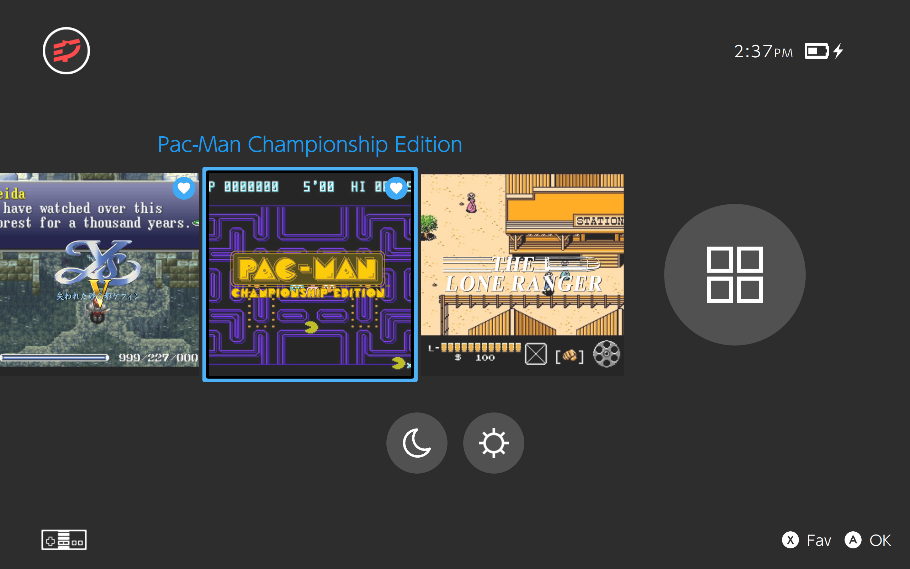
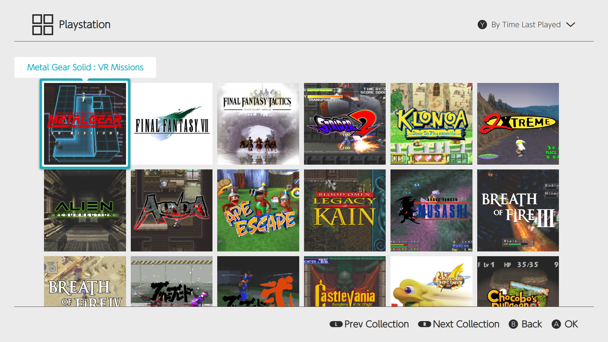

# skylineOS

A clean and simple theme that aims to recreate the experience of Nintendo's Switch console. skylineOS is a theme for [Pegasus Frontend](http://pegasus-frontend.org/) forked from switchOS.

___

## Installation

Simply download the theme and place it in your [Pegasus theme directory](http://pegasus-frontend.org/docs/user-guide/installing-themes/) under a folder called skylineOS.

See [wiki](https://github.com/RBertoCases/skylineOS/wiki) for more information.

## Latest Release
### v0.15
  - Added Favorites - Courtesy of [ismaelestalayo](https://github.com/ismaelestalayo/skylineOSP)
      - Toggle highlighted game as Favorite
      - View Favorites List as Sort/Filter option in Software Screen
  - Added ability select Boxart as a Game Background preference in Theme Settings - Courtesy of [ismaelestalayo](https://github.com/ismaelestalayo/skylineOSP)
  - Switched source of Button Prompts - Author/Source: [Zacksly](https://zacksly.itch.io/switch-button-icons-and-controls) Licensed under [CC BY 3.0](https://creativecommons.org/licenses/by/3.0/)
  - improved appearance of battery indicator on HomeScreen on Windows (not perfect, but better)
  - General system stability improvements have been made to enhance the user's experience

See [RELEASES.md](RELEASES.md) for full version history.
___

## Attributions

Button Prompts

- Author: [Zacksly](https://zacksly.itch.io)
- Source: https://zacksly.itch.io/switch-button-icons-and-controls
- License: [CC BY 3.0](https://creativecommons.org/licenses/by/3.0/)